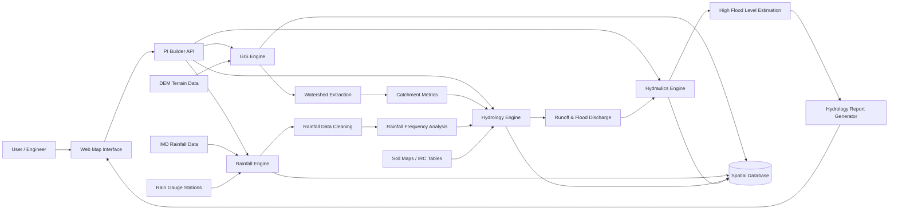

# System Architecture v0.001

## Core Components

- Web Application
- API Layer
- GIS Engine
- Rainfall Engine
- Runoff Engine
- Hydrology Engine
- Hydraulic Engine
- Report Generator

## Processing Pipeline

User location → watershed extraction → rainfall analysis → runoff → discharge → HFL → report
