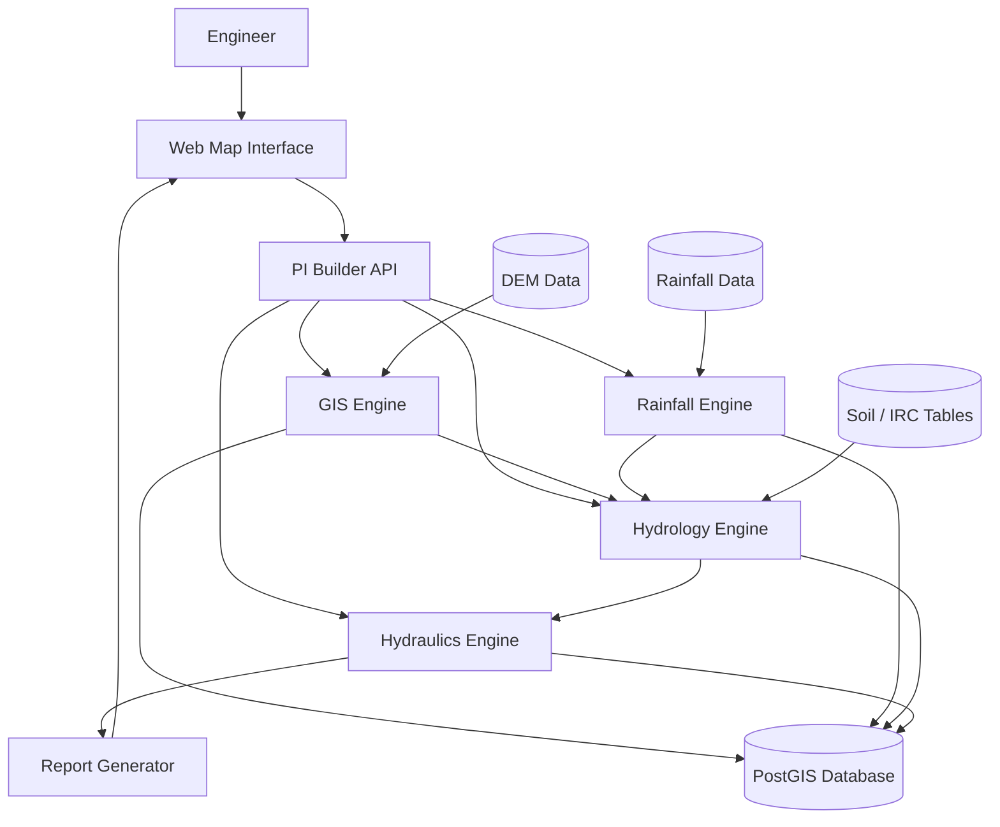

# System Architecture

PI Builder uses a **modular backend architecture** optimized for heavy geospatial computation.

## Architecture Diagram

## Layers

1. User Interface (map + project interface)
2. API Layer (FastAPI)
3. Domain Engines (GIS, Rainfall, Hydrology, Hydraulics)
4. Compute Workers (heavy jobs)
5. Data Layer (PostGIS + raster datasets)