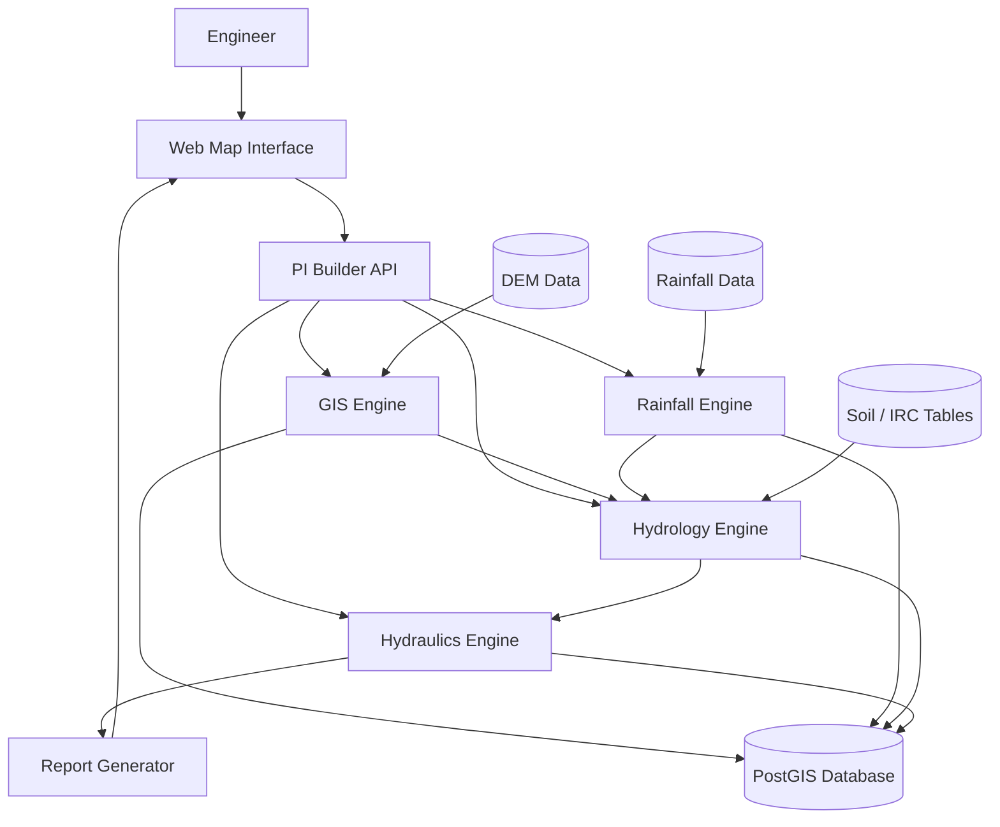

# PI Builder — System Architecture

PI Builder is a **geospatial computation platform** designed to automate hydrology analysis for infrastructure design workflows such as bridges, culverts, and drainage structures.

The system separates responsibilities into modular layers so that heavy geospatial computations can scale while development remains fast during the MVP stage.

---

# Architecture Overview

---

# Architectural Layers

PI Builder is organized into five logical layers:

1. User Interface  
2. API Layer  
3. Domain Engines  
4. Data Layer  
5. Report Generation

Each layer has clearly defined responsibilities.

---

# 1. User Interface Layer

The user interface is the entry point to the platform.

Responsibilities:

- Display an interactive map
- Allow engineers to select project locations
- Visualize watershed boundaries
- Display hydrology results
- Provide downloadable reports

Typical technologies:

- React
- Leaflet or Mapbox

---

# 2. API Layer

The API layer orchestrates system operations.

Responsibilities:

- Receive requests from the UI
- Validate inputs
- Trigger computation engines
- Coordinate workflows
- Return results to the user interface

Recommended implementation:

FastAPI

Advantages:

- Async support
- High performance
- Automatic API documentation
- Strong typing

---

# 3. Domain Engines

Core computational logic is implemented as **domain engines**.

## GIS Engine

Responsibilities:

- Load DEM terrain datasets
- Compute flow direction
- Compute flow accumulation
- Extract stream networks
- Delineate watershed boundaries
- Compute catchment metrics

Output:

- Watershed polygon
- Catchment area
- Terrain characteristics

---

## Rainfall Engine

Responsible for rainfall analysis.

Typical datasets:

- IMD gridded rainfall
- Rain gauge station data

Operations:

- Clean rainfall time series
- Extract annual maxima
- Rainfall frequency analysis
- Estimate rainfall intensity

Methods:

- Log Pearson Type III
- Curve fitting

Output:

Rainfall intensity for the catchment.

---

## Hydrology Engine

Converts rainfall into flood discharge.

Typical formula:

Q = C × I × A

Where:

- Q = peak discharge
- C = runoff coefficient
- I = rainfall intensity
- A = catchment area

Output:

Peak flood discharge.

---

## Hydraulics Engine

Converts discharge into water level estimates.

Goal:

Determine **High Flood Level (HFL)**.

Inputs:

- Flood discharge
- Channel slope
- Roughness coefficient
- River cross section

Method:

Manning equation

Output:

Predicted flood level.

---

# 4. Data Layer

The data layer stores both external datasets and system-generated outputs.

External datasets:

- DEM terrain models
- Rainfall datasets
- Rain gauge records
- Soil and runoff coefficient tables

Internal data:

- Project definitions
- Watershed geometries
- Rainfall analysis outputs
- Hydrology results
- Generated reports

Recommended storage:

PostgreSQL + PostGIS

---

# 5. Report Generation

The report engine compiles analysis results into structured hydrology reports.

Typical contents:

- Project location
- Watershed maps
- Rainfall analysis
- Discharge calculations
- High Flood Level estimation

These reports resemble hydrology sections used in infrastructure design documents.